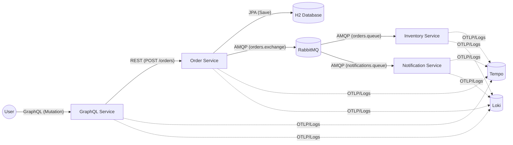

# Distributed Tracing Demo Walkthrough

This system demonstrates end-to-end tracing across different communication protocols using Micrometer Tracing.

## System Architecture



## System Flow & Capabilities

### 1. GraphQL Service (Entry Point)
- **Port**: 8080
- **Technology**: Spring Boot 4.0.1, Spring GraphQL
- **Action**: Receives `createOrder` mutation.
- **Tracing**: Starts the trace (Root Span).

### 2. Order Service (Processor)
- **Port**: 8081
- **Technology**: Spring Boot 4.0.1, Spring Web, Spring Data JPA
- **Action**:
  1.  Receives REST call.
  2.  **Saves to H2 Database**: This operation is automatically traced by Micrometer & Datasource instrumentation.
  3.  Publishes message to RabbitMQ.
- **Tracing**: Continues trace from HTTP headers; creates spans for DB and Messaging.

### 3. Inventory Service (Consumer)
- **Port**: 8082
- **Technology**: Spring Boot 4.0.1, RabbitMQ Listener
- **Action**: Consumes message, simulates inventory update.
- **Tracing**: Continues trace from AMQP headers.

## Running the Demo

1.  **Start Infrastructure**:
    ```bash
    docker-compose up -d
    ```
2.  **Run Services**:
    Run the 3 applications (`graphql-service`, `order-service`, `inventory-service`) via Maven or your IDE.

3.  **Generate Traffic**:
    - Import `postman_collection.json` into Postman.
    - Run the "Create Order (GraphQL)" request.

4.  **Analyze Observability**:
    - Open **Grafana**: `http://localhost:3000`
    - Go to **Explore** -> **Tempo**.
    - Find the latest trace.
    - You will see a rich waterfall graph including the **Database Insert** span in the middle!
### 4. Future Improvement: Notification Service
To demonstrate **Fan-Out Tracing**, you can add a `notification-service`.
- **Role**: Second consumer of `orders.exchange`.
- **Effect**: When an order is placed, the trace splits into two branches (`inventory-service` and `notification-service`) running in parallel.
- **Visual**: The Tempo trace would show two spans starting at the same time under the AMQP publish traverse.

## Demo Presentation Script (For Your Team)

Use this script to demonstrate the power of Distributed Tracing to your colleagues.

**1. The Setup (Show the Code)**
- Open `OrderController.java` (GraphQL Service) and show `@NewSpan("graphql.createOrder")`. Explain: *"We explicitly named this span to track this specific business operation."*
- Open `OrderController.java` (Order Service) and show `@NewSpan("order.process")`. Explain: *"We track the REST processing here."*
- Show `OrderListener.java` and `NotificationListener.java`. Explain: *"We trace async consumers automatically, continuing the context from RabbitMQ."*

**2. The Trigger (Postman)**
- Open Postman.
- Run **Create Order (GraphQL)**.
- Show the response `orderId`.

**3. The Reveal (Grafana Tempo)**
- Open Grafana (`http://localhost:3000`) -> Explore -> Tempo -> Query type: Search.
- Run Query. Click the latest trace.
- **Walk through the Waterfall:**
    1.  **Root**: `graphql-service` (The entry point).
    2.  **Child**: `graphql.createOrder` (Our custom business span).
    3.  **HTTP Call**: `POST /orders` (Auto-instrumented).
    4.  **Processor**: `order.process` (Order Service logic).
    5.  **Database**: `insert into orders...` (Automatic JDBC tracing!).
    6.  **Fan-Out**: `orders.exchange publish`.
    7.  **Async 1**: `inventory.update` (Inventory Service).
    8.  **Async 2**: `notification.send` (Notification Service).
- **Point out Attributes**: Click on the spans and show the `product.id` and `order.quantity` tags in the right panel.
- **Logs**: Toggle "Logs" to see the logs from Loki correlated with the trace ID.
